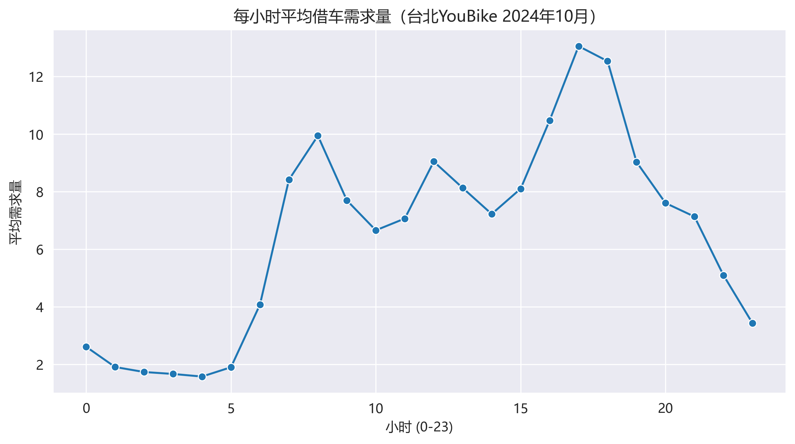
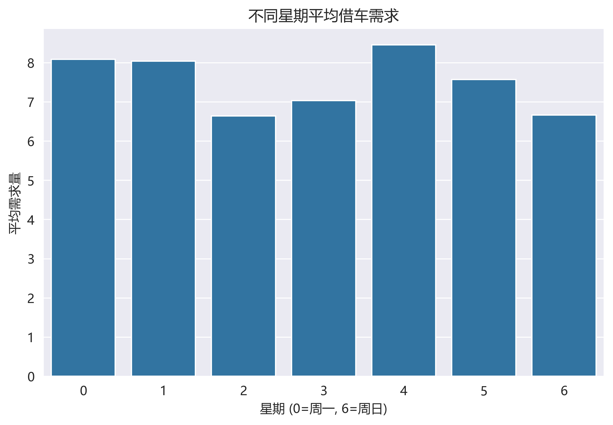
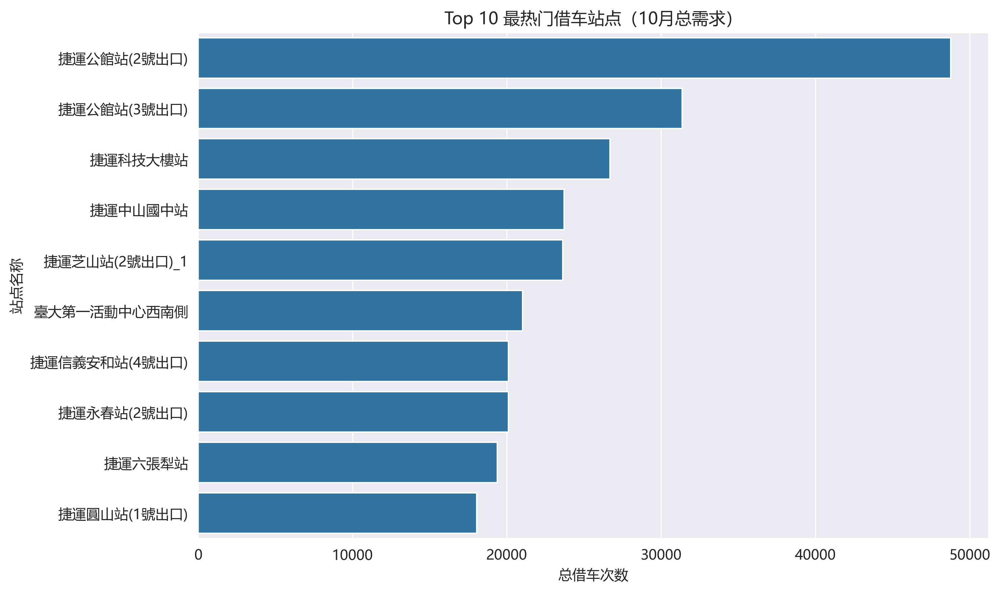
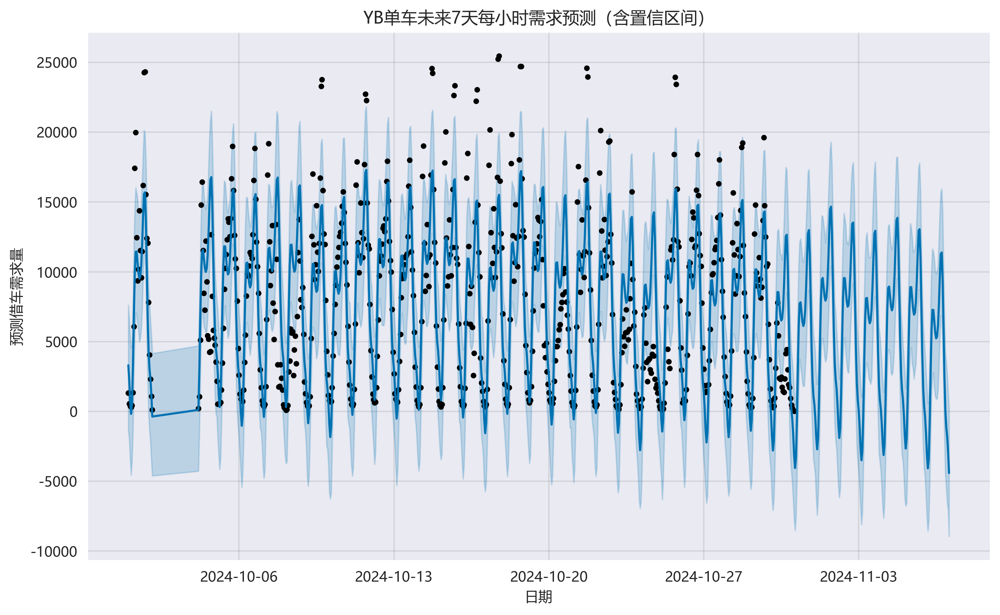

# Taipei YouBike Demand Forecasting & Operations Analytics

基于台北 YouBike 2024 年 10 月骑行日志的共享单车需求预测与运营分析项目。项目从 525 万+ 条借还车记录出发，完成数据清洗、小时级需求聚合、站点画像、潮汐风险识别、调度策略生成和未来 7 天需求预测，目标是帮助运营团队提前识别「无车可借」和「无位可还」风险。


## 项目亮点

- **完整业务闭环**：从原始骑行日志清洗，到指标建模、风险识别、预测建模，再到调度建议输出。
- **运营指标体系**：构建 `borrow_demand`、`return_demand`、`net_flow`、`imbalance_score` 等指标，量化站点供需失衡。
- **站点分层分析**：将站点划分为潮汐流入型、潮汐流出型、通勤型、稳定休闲型，支撑差异化调度。
- **风险优先级排序**：识别高风险站点，并为不同站点类型生成补车、清车、预留车位等运营建议。
- **短期需求预测**：使用 Prophet 对未来 7 天需求进行预测，为提前调度提供参考。
- **可展示 Dashboard**：输出 Tableau 风格运营看板截图，适合作品集、面试讲解和简历项目链接。

## 业务问题

共享单车系统存在明显的潮汐流动：早高峰部分住宅区车辆大量流出，办公区、商圈、学校周边车辆快速流入；晚高峰则出现相反方向。如果运营团队不能提前识别这些站点，就容易出现用户无车可借、无位可还和调度成本上升。

本项目重点回答：

1. 一天中哪些时段是借还车需求高峰？
2. 工作日与周末的需求模式有什么差异？
3. 哪些站点是核心热门站点和高风险站点？
4. 如何用净流量刻画站点潮汐特征？
5. 如何根据站点类型和风险等级生成调度建议？
6. 能否预测短期需求，辅助运营提前准备？

## 数据与技术栈

| 类型 | 内容 |
| --- | --- |
| 数据来源 | 台北 YouBike 2024 年 10 月公开骑行日志 |
| 数据规模 | 约 525.8 万条借还车记录 |
| 分析粒度 | 站点、日期、小时 |
| 数据处理 | Python, Pandas, NumPy |
| 数据查询 | SQL, SQLite |
| 可视化 | Matplotlib, Seaborn, Tableau |
| 预测模型 | Prophet |
| 交付形式 | Jupyter Notebook, CSV, PNG, SQL, Dashboard |

> 说明：原始 CSV 和 SQLite 数据库体积较大，已通过 `.gitignore` 排除，避免 GitHub 仓库过大。仓库保留代码、SQL、分析结果表、图表和 dashboard 截图；完整数据复现方式见 [data/README.md](data/README.md)。

## 核心方法

### 1. 小时级需求聚合

将原始借还车日志清洗后，按站点、日期、小时聚合，分别计算借车需求与还车需求。

```text
net_flow = borrow_demand - return_demand
```

- `net_flow > 0`：车辆净流出，站点可能出现无车可借。
- `net_flow < 0`：车辆净流入，站点可能出现无位可还。

### 2. 站点画像与分层

基于早晚高峰净流量、峰值需求占比、周末需求占比等特征，将站点分为四类：

| 站点类型 | 业务解释 |
| --- | --- |
| 潮汐流出型 | 早高峰车辆大量流出，常见于住宅区或通勤出发地 |
| 潮汐流入型 | 早高峰车辆大量流入，常见于办公区、商圈或学校周边 |
| 通勤型 | 早晚高峰需求占比较高，但净流向不一定极端 |
| 稳定休闲型 | 需求相对平稳，高峰特征不明显 |

### 3. 风险评分

使用早晚高峰净流量规模构建站点调度压力指标：

```text
imbalance_score = abs(morning_net_flow_sum) + abs(evening_net_flow_sum)
```

分数越高，表示站点越容易在高峰期出现车辆或车位不足，需要优先纳入调度监控。

### 4. 调度策略

结合 `station_type` 和 `risk_level` 生成初步调度建议：

- 高风险潮汐流出型站点：早高峰前补车，晚高峰后关注车位回流。
- 高风险潮汐流入型站点：早高峰前预留车位，晚高峰前安排车辆清运。
- 通勤型站点：围绕早晚高峰进行重点监控。
- 稳定休闲型站点：保持常规巡检，避免过度调度。

## 主要发现

- 2024 年 10 月总借车量约 525.8 万次，总还车量约 525.8 万次。
- 借车需求高峰集中在晚高峰，Top 小时包括 17 点、18 点、16 点、8 点和 12 点。
- 热门站点包括 `捷运公馆站(2号出口)`、`捷运公馆站(3号出口)`、`捷运科技大楼站` 等。
- 潮汐流入型与潮汐流出型站点的平均风险显著高于通勤型和稳定休闲型站点。
- Prophet 能捕捉日内与周内周期性，可作为短期调度参考，但生产环境中建议加入非负约束与更多外部特征。

## 可视化结果

### 每小时需求趋势



### 工作日与周末需求差异



### 热门站点 Top 10



### 未来 7 天需求预测



### 风险与调度看板


## 项目结构

```text
YouBike_Project/
├── dashboard/                  # Dashboard 截图
├── data/
│   ├── README.md               # 数据文件说明与复现提示
│   ├── processed/              # 可提交的小型结果表；大型中间表已忽略
│   └── raw/                    # 原始数据目录，默认不提交
├── docs/
│   └── resume_project_summary.md
├── notebooks/                  # 分步骤分析 Notebook
├── reports/
│   ├── figures/                # 分析图表
│   └── tables/                 # 汇总结果表
├── SQL/
│   └── all_code.sql            # 指标验证与业务查询 SQL
├── .gitignore
├── requirements.txt
└── README.md
```

## 运行方式

建议使用 Python 3.10+。

```bash
python -m venv .venv
source .venv/bin/activate      # Windows PowerShell: .\.venv\Scripts\Activate.ps1
pip install -r requirements.txt
jupyter notebook
```

Notebook 建议从项目根目录启动，这样相对路径可以正常读取：

```bash
jupyter notebook
```

推荐阅读顺序：

| 顺序 | Notebook | 内容 |
| --- | --- | --- |
| 0 | `00_all_code.ipynb` | 汇总版完整流程 |
| 1 | `01_import_data.ipynb` | 数据导入与清洗 |
| 2 | `02_hourly_demand.ipynb` | 小时级借车需求聚合 |
| 3 | `03_flow_hourly.ipynb` | 借还车流量与净流量 |
| 4 | `04_eda_analysis.ipynb` | 探索性分析与图表 |
| 5 | `05_station_profile.ipynb` | 站点画像与分层 |
| 6 | `06_risk_level.ipynb` | 风险等级识别 |
| 7 | `07_dispatch_strategy.ipynb` | 调度策略生成 |
| 8 | `08_forecast_prophet_model.ipynb` | 未来 7 天需求预测 |
| 9 | `ps_create_database_for_sql.ipynb` | SQLite 数据库构建 |

## SQL 分析

[SQL/all_code.sql](SQL/all_code.sql) 包含以下查询：

- 全天需求高峰识别
- 工作日与周末需求对比
- Top20 热门站点识别
- 站点类型数量分布
- 不同站点类型平均风险
- Top20 高风险站点
- 风险等级分布
- 调度策略分布

## 简历写法

可参考 [docs/resume_project_summary.md](docs/resume_project_summary.md) 中的简历 bullet 和面试讲述版本。

示例：

> 基于 525 万+ 条台北 YouBike 骑行日志，使用 Python、SQL 和 Prophet 构建共享单车需求预测与运营分析项目；完成小时级需求聚合、站点潮汐流识别、风险评分和调度策略生成，并输出 Tableau 风格运营看板，为车辆补给、车位预留和高风险站点监控提供数据支持。

## 后续优化方向

- 引入天气、节假日、站点容量、地理位置等外部特征。
- 使用 LightGBM、XGBoost 或 Poisson 回归等更适合计数需求的模型。
- 对 Prophet 预测结果增加非负约束。
- 将调度策略从文本标签进一步量化为建议补车/清车数量。
- 补充模型评估指标，例如 MAE、RMSE、MAPE，并与 baseline 对比。
